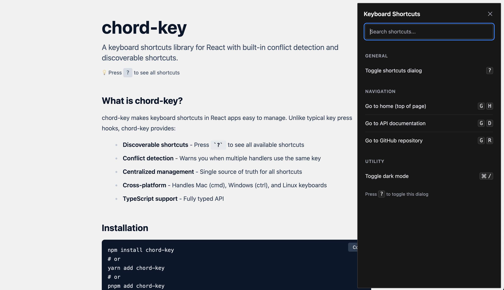

# chord-key

a keyboard shortcuts library for react with built-in conflict detection and discoverable shortcuts.



## what is chord-key?

chord-key makes keyboard shortcuts in react apps easy to manage. unlike typical key press hooks, chord-key provides:

- **discoverable shortcuts** - press `?` to see all available shortcuts
- **conflict detection** - warns you when multiple handlers use the same key
- **centralized management** - single source of truth for all shortcuts
- **cross-platform** - handles mac (cmd), windows (ctrl), and linux keyboards
- **typescript support** - fully typed api

## installation

```bash
npm install chord-key
# or
yarn add chord-key
# or
pnpm add chord-key
```

## quick start

wrap your app with the provider and use the hooks:

```tsx
import { KeyPressProvider, useKeyPress } from 'chord-key';

function App() {
  return (
    <KeyPressProvider>
      <YourApp />
    </KeyPressProvider>
  );
}

function YourComponent() {
  useKeyPress({
    key: 'cmd+k',
    description: 'open command palette',
    onPress: () => console.log('opened'),
  });

  return <div>your content</div>;
}
```

## api

### useKeyPress

handle single keys or key combinations.

```tsx
import { useKeyPress } from 'chord-key';

function Editor() {
  useKeyPress({
    key: 'cmd+s',
    description: 'save document',
    category: 'editor',
    onPress: () => saveDocument(),
  });

  useKeyPress({
    key: 'cmd+shift+p',
    description: 'open command palette',
    onPress: () => openPalette(),
  });

  return <div>...</div>;
}
```

**options:**

```tsx
interface KeyPressConfig {
  key: string;                    // e.g. "cmd+k", "ctrl+shift+s"
  description: string;            // shown in help modal
  onPress: () => void;            // callback when pressed
  category?: string;              // group in help modal
  enabled?: boolean;              // conditionally enable/disable
  preventDefault?: boolean;       // prevent browser defaults
  eventType?: 'keydown' | 'keyup' | 'keypress';
}
```

### useKeySequence

handle key sequences like vim (press `g` then `h`).

```tsx
import { useKeySequence } from 'chord-key';

function Navigation() {
  useKeySequence({
    sequence: ['g', 'h'],
    description: 'go to home',
    category: 'navigation',
    onComplete: () => navigate('/'),
  });

  useKeySequence({
    sequence: ['g', 'i'],
    description: 'go to inbox',
    onComplete: () => navigate('/inbox'),
  });

  return <div>...</div>;
}
```

**options:**

```tsx
interface KeySequenceConfig {
  sequence: string[];             // e.g. ["g", "h"]
  description: string;            // shown in help modal
  onComplete: () => void;         // callback when sequence completes
  category?: string;              // group in help modal
  enabled?: boolean;              // conditionally enable/disable
  timeout?: number;               // ms between keys (default: 1000)
  eventType?: 'keydown' | 'keyup' | 'keypress';
}
```

### useKeyboardShortcuts

get all registered shortcuts, grouped by category. useful for building custom shortcut displays.

```tsx
import { useKeyboardShortcuts } from 'chord-key';

function CustomShortcutsList() {
  const { handlers, groupedHandlers } = useKeyboardShortcuts();

  return (
    <div>
      {groupedHandlers.map(([category, shortcuts]) => (
        <div key={category}>
          <h3>{category}</h3>
          <ul>
            {shortcuts.map((shortcut, i) => (
              <li key={i}>
                <kbd>{shortcut.keySequence.join(' ')}</kbd>
                <span>{shortcut.description}</span>
              </li>
            ))}
          </ul>
        </div>
      ))}
    </div>
  );
}
```

**returns:**

```tsx
{
  handlers: HandlerInfo[];           // all registered shortcuts
  groupedHandlers: [string, HandlerInfo[]][];  // grouped by category
}

interface HandlerInfo {
  keySequence: string[];    // e.g. ["cmd+s"] or ["g", "h"]
  description: string;
  category: string;
  component: string;
}
```

### ShortcutsDialog

built-in modal to display all shortcuts. press `?` by default to open.

```tsx
import { ShortcutsDialog } from 'chord-key';

function App() {
  return (
    <KeyPressProvider>
      <YourApp />
      <ShortcutsDialog helpKey="?" />
    </KeyPressProvider>
  );
}
```

**options:**

```tsx
interface ShortcutsDialogProps {
  helpKey?: string;  // key to open modal (default: "?")
}
```

### KeyPressProvider

context provider for managing shortcuts globally. wrap your app with this to enable keyboard shortcuts.

```tsx
import { KeyPressProvider } from 'chord-key';

function App() {
  return (
    <KeyPressProvider>
      <YourApp />
    </KeyPressProvider>
  );
}
```

## examples

### organizing with categories

categories group shortcuts in the help modal:

```tsx
function App() {
  useKeyPress({
    key: 'cmd+n',
    description: 'new file',
    category: 'file',
    onPress: () => createFile(),
  });

  useKeyPress({
    key: 'cmd+o',
    description: 'open file',
    category: 'file',
    onPress: () => openFile(),
  });

  useKeyPress({
    key: 'cmd+f',
    description: 'find',
    category: 'search',
    onPress: () => openSearch(),
  });

  return <div>...</div>;
}
```

### conditional shortcuts

enable/disable shortcuts based on state:

```tsx
function Editor() {
  const [isEditing, setIsEditing] = useState(false);

  useKeyPress({
    key: 'cmd+s',
    description: 'save',
    enabled: isEditing,
    onPress: () => save(),
  });

  useKeyPress({
    key: 'escape',
    description: 'cancel editing',
    enabled: isEditing,
    onPress: () => setIsEditing(false),
  });

  return <div>...</div>;
}
```

### complex sequences

```tsx
function VimMode() {
  useKeySequence({
    sequence: ['g', 'g'],
    description: 'go to top',
    category: 'navigation',
    onComplete: () => scrollToTop(),
  });

  useKeySequence({
    sequence: ['shift+g'],
    description: 'go to bottom',
    category: 'navigation',
    onComplete: () => scrollToBottom(),
  });

  return <div>...</div>;
}
```

## development

this is a turborepo monorepo containing:

- **chord-key** - the core library (vite + rolldown)
- **website** - docs and demo (next.js 16)

### setup

```bash
# install dependencies
npm install

# run all dev servers
npm run dev

# build all packages
npm run build

# run tests
npm run test

# lint
npm run lint
```

### working with packages

```bash
# work on library
cd chord-key
npm run dev

# work on website
cd website
npm run dev
```

## roadmap

- **compile-time conflict detection** - typescript plugin to catch conflicting shortcuts at build time
- **category autocomplete** - typescript autocomplete for category names to keep them consistent
- **community contributions welcome** - open to suggestions and improvements

## contributing

contributions are welcome! please open an issue or submit a pull request at [github.com/madebyaman/chord](https://github.com/madebyaman/chord).

## license

MIT - see [LICENSE](LICENSE) for details.

**author:** madebyaman
